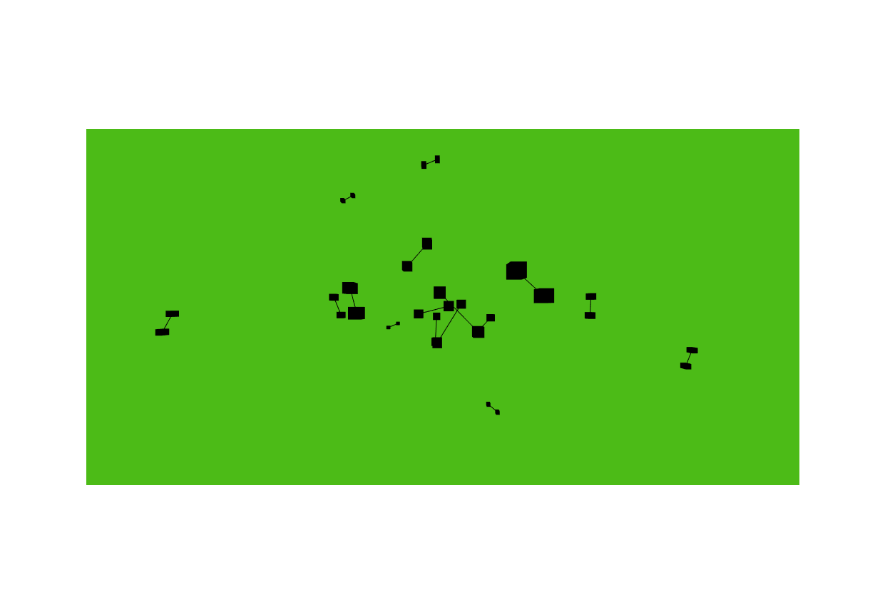

# fourdd.js
Dynamic 3D graphs displayed in the browser, controlled via REST API, with up to about 250 vertices at once on my machine. (The number of edges also plays a role in this thing's speed).

This is the successor to FourDSocketProxy. Since FourDSocketProxy found a niche among almost 1000 users as of August 2019, I decided to write a nicer version. fourdd is that version, the name change is part of the release.

This version still only shows about 1000 vertices, but feel free to submit a pull request should you decide to take a look at the paper [Dynamic Multilevel Graph Visualization](https://arxiv.org/abs/0712.1549), and get better version working. 

## Prequisites
1. Node.js
2. A modern web browser

The sample scripts in graph also require curl. 

## Installation
Clone the repo and run npm install

1. `git clone https://code.joshuamoore.dev/me/fourdd.git`
2. `cd fourdd`
3. `npm install`

## Running
`./graph/start` This starts the fourd server, named fourdd. You can optionally include `--port 8000` or what ever valid port number you choose, but you will have to specify the port in the following commands, as well, preferably at the end, so the flag doesn't collide with the positional parameters. 

Then open a webbrowser at [http://localhost:8000/](http://localhost:8000)

Switch to another console.

Take a look at the files called `vertex` and `edge`. They demonstrate how to make a simple http request to fourdd. 

1. `./graph/vertex add --label-text "Some Text"` adds a vertex, optionally with a label, and returns the id of the newly created vertex.
2. `./graph/edge add 0 1` adds an edge between vertices 0 and 1. 
3. `./graph/vertex rm 0` removes the first vertex. Likewise,
4. `./graph/edge rm 0` removes the first edge, if it hasn't already been deleted by removing a vertex connected to this edge.

See below for options.

## REST API
The sample scripts `./graph/vertex`, `./graph/edge`, and `./graph/clear` are wrappers for the REST API. 

By default, the server, fourdd.js, starts on port 8000. If that conflicts with something else you have running, you can specify `--port 5000` or your desired port number. 

Send a POST request to the routes `/add_vertex`, `/add_edge`, or `/clear`, appending some of the following parameters, the defaults will be used where no choice is made.

* `/add_vertex` Adds a vertex to the graph
  Query Parameters:
    * `cube_size=10`
    * `cube_color=darkblue` or `cube_color=0x000000`
    * `cube_texture=img-url.png`
    * `label_size=10`
    * `label_text=<Your Text Here>`
* `/add_edge`
  Query Parameters:
    * `a=<vertex_id>` The source vertex
    * `b=<vertex_id>` The target vertex
* `/clear` Clears the scene and restarts numbering at 0. 

The server starts at port 8000, This can be configured via `node fourdd.js --port <port#>`.

## Bash Scripts
For reference, there are three bash files included: 
* vertex
* edge
* clear

Their functions are described below:

### Vertices
After spinning up `node fourdd.js`, you can send a post request to the server, something like

* `POST http://localhost:PORT/add_vertex`

Options are passed in as query parameters. 

`POST http://localhost:8000/?cube_size=10&cube_color=darkblue&label_text=Greetings`.

* `./vertex add <vertex-options>`

where `<vertex-options>` is some combination of the following:

* Cube options: 

  * `--cube-size <int>`
  * `--cube-color <color>`
  * `--cube-texture `

* Label Options:

  * `--label-text <string>`
  * `--label-size <int>`
  * `--label-offiset <int>`

* General Options
The port can be specified using `--port <port#>`

### Edges
You can create an edge by specifying the ids of the source and target vertices.

* `POST https://localhost:PORT/add_edge?a=0&b=1`, where a and b are the vertex ids returned by the /add_vertex end point.

* `./edge add <source id> <target id> [--port <port#>]`

For the moment, undirected edges are supported, only, though I am hoping to add bezier curves, and self joining edges.

### Clear
Clears the graph, and resets the starting vertex and edge ids to 0. 

## Known Isssues

* graph clear doesn't work right. My guess is that the numbers don't get reset internally. 
